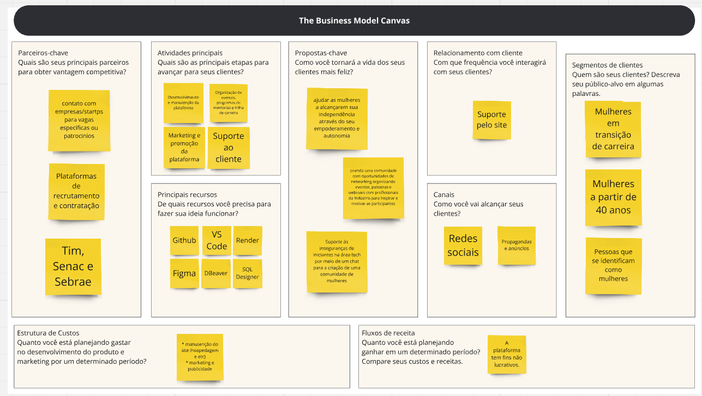
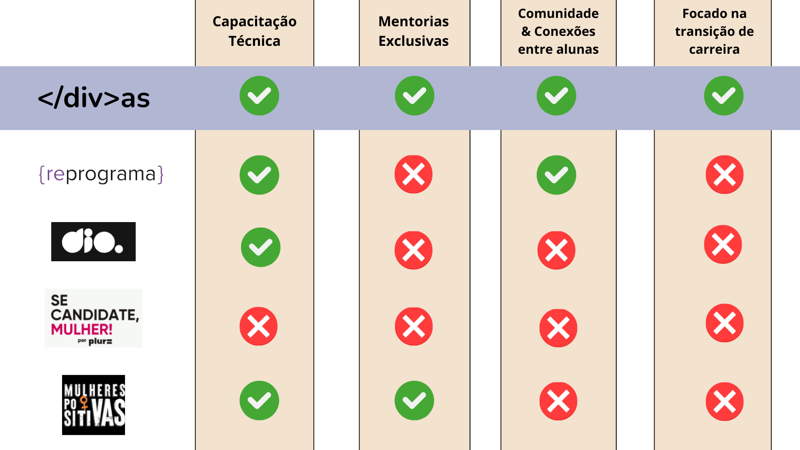

# `</div>as` - Equipe 26

#### Integrantes:
- <a href="https://www.linkedin.com/in/ana-beggiato/">Ana Beatriz Passos Beggiato</a>
- <a href="https://www.linkedin.com/in/gabriela-silvaa/">Gabriela Silva</a>
- <a href="https://www.linkedin.com/in/laura-rodrigues31/">Laura de Araújo Rodrigues</a>
- <a href="https://www.linkedin.com/in/mariana-namie-guima-b5592b243/">Mariana Namie Guima</a>
- <a href="https://www.linkedin.com/in/thalyta-viana/">Thalyta da Silva Viana</a>

## Sumário

[1. Introdução](#c1)

[2. Problema](#c2)

[3. Análise de Mercado](#c3)

[4. Diferenciais da Solução das `</div>as`](#c4)

[5. Tecnologias](#c5)

[6. Conclusões e Próximos Passos](#c6)

[7. Referências](#c7)

#### WAD - Web Apllication Document: Para conferir a documentação detalhada do desenvolvimento da aplicação web com arquitetura de software, guia de estilo, protótipos, entre outros, confira o link:  (Divas > Documentos > WAD.me)


# <a name="c1"></a>1. Introdução

&nbsp;&nbsp;&nbsp;&nbsp;A plataforma web `</div>as` desenvolvida pela equipe `</div>as` foi feita para resolver o desafio proposto pela TIM: Criar uma solução para inclusão de mulheres nas vagas de tecnologia, sejam vagas profissionais, sejam vagas de liderança. Pensando em formas eficazes e inovadoras para resolver a problemática trazida, a aplicação web `</div>as` foi criada. Por meio dela, conectamos mulheres em transição de carreira para a área de tecnologia com outras mulheres já estabelecidas nesse campo em cargos de tecnologia e liderança em grandes empresas, como a TIM. Através de uma plataforma web, a iniciativa busca empoderar, encorajar e incluir essas mulheres em um mercado marcado por questões sociais e de gênero. 

&nbsp;&nbsp;&nbsp;&nbsp;A plataforma oferece mentorias personalizadas com mentoras voluntárias que atuam na TIM, trilhas técnicas especializadas e workshops, com o objetivo de capacitar as participantes que vieram de outras áreas para as vagas na área de tecnologia. Além disso, cria um ambiente de comunidade unida, onde as trajetórias individuais se encontram, permitindo que, juntas, elas construam conexões significativas para superar os desafios da transição de carreira, alcançar metas e criar com sucesso uma nova carreira na área tech, transformando vidas e inspirando novas gerações de mulheres líderes na tecnologia.

# <a name="c1"></a>2. Problema

&nbsp;&nbsp;&nbsp;&nbsp;O problema específico que está sendo abordado é a sub-representação de mulheres, especialmente aquelas em transição de carreira mais avançadas em idade, em cargos de tecnologia e liderança, impedindo-as de conquistar vagas e oportunidade de trabalho na área tecnológica. Esta disparidade de gênero e de idade que o mercado enfrenta resulta em ambientes de trabalho menos diversos e inclusivos, criando barreiras significativas para mulheres que desejam mudar de carreira para a área de tecnologia e encontrar novas vagas e oportundades. Elas enfrentam desafios como a falta de mentoria e apoio, ambientes predominantemente masculinos, estereótipos de gênero e preconceitos implícitos, falta de pertencimento à uma comunidade que entenda suas dores, além de menor acesso a projetos desafiadores e visíveis. Além disso, a cultura organizacional frequentemente não apoia a diversidade de gênero e muito menos de idade, desencorajando essas mulheres a buscar ou permanecer em carreiras tecnológicas.

&nbsp;&nbsp;&nbsp;&nbsp;As causas subjacentes desse problema incluem estereótipos de gênero e idade desde a educação básica. A falta de modelos femininos em posições de destaque na tecnologia faz com que a perpetuação de preconceitos implícitos em processos de contratação e promoção não seja combatida e nem repudiada. Estatísticas ilustram a gravidade desse problema que combina uma série de fatores: Um estudo promovido pela UNESCO mostra que a proporção de mulheres estudando nas áreas STEM é de apenas 44 delas entre 100 profissionais, reforçando o impacto que os estereótipos causam na vida acadêmica e profissional destas mulheres. 

&nbsp;&nbsp;&nbsp;&nbspAlém disso, segundo a pesquisa da Woman in Technology, menos de 20% de todos os cargos de tecnologia no brasil são ocupados por mulheres. Expandindo essa linha de raciocínio para um escopo macro, menos de 30% dos cargos de liderança em toda a américa latina são ocupados por líderes mulheres.

&nbsp;&nbsp;&nbsp;&nbsp;Esses dados refletem a importância de soluções e iniciativas que têm como principal público-alvo as mulheres, mas, principalmente, àquelas em transição de carreira para a área de tecnologia, com foco em seu desenvolvimento, em sua inclusão, não só na comunidade tecnológica, mas, também, em uma comunidade em que ela possa desenvolver conexões com outras mulheres em situações similares e, além disso, formas de superar estereótipos tão grandes quanto o etarismo e a disparidade de genêro.

# <a name="c3"></a>3.Análise de mercado

&nbsp;&nbsp;&nbsp;&nbsp;Durante o processo de idealização e estruturação das `</div>as`, ferramentas e metódos como business model canvas e análise swot foram construídos para que houvesse mais compreensão do escopo do projeto e do mercado à que ele pertence.

## Business Model Canvas 

&nbsp;&nbsp;&nbsp;&nbsp;A análise de negócios através do Business Model Canvas desempenha um papel essencial na definição e no sucesso de qualquer empreendimento. Este framework oferece uma visão estruturada e holística das principais componentes de um negócio, como proposta de valor, segmentos de clientes, canais de distribuição, fontes de receita, entre outros. Ao permitir uma análise detalhada e interconectada desses elementos, o Canvas não apenas facilita a compreensão do modelo de negócios, mas também orienta decisões estratégicas fundamentais, promovendo a inovação, a eficiência operacional e a sustentabilidade a longo prazo das organizações. Portanto, para que fosse possível idealizar com qualidade o projeto, o seguinte business model canvas foi desenvolvido:

<div align="center">
  <sub><a name="f1"></a>Figura 01 - Business Model Canvas</sub>
  <br>
  
  <br>
  <sup>Fonte: Elaborado pelos autores (2024)</sup>
</div>

## Análise SWOT

&nbsp;&nbsp;&nbsp;&nbsp; Além dessa ferramenta, uma análise swot foi desenvolvida para identificar e avaliar os pontos fortes (Strengths), fraquezas (Weaknesses), oportunidades (Opportunities) e ameaças (Threats) do `</div>as`. Serve para ajudar na compreensão das capacidades internas e desafios externos, permitindo a formulação de estratégias mais eficazes. Ao identificar essas quatro áreas, pode-se aproveitar seus pontos fortes, mitigar fraquezas, explorar oportunidades e se preparar para ameaças, facilitando a tomada de decisões informadas e o planejamento estratégico.
&nbsp;&nbsp;&nbsp;&nbsp A seguinte análise SWOT foi desenvolvida pensando na aplicação web `</div>as`:

### Forças

- Patrocínio exclusivo da TIM
- Senso de comunidade e conexão com outras mulheres
- Moldado para iniciantes na tecnologia
- Capacitação e desenvolvimento por meio de mentores do mercado de trabalho
- Ambiente online e trilhas assíncronas


### Fraquezas

- Dependência significativa da parceria com a TIM
- Necessidade de manter a plataforma tecnologicamente atualizada
- Possível dificuldade de engajamento contínuo das participantes
- Limitações na personalização das trilhas técnicas para diferentes perfis

### Oportunidades 

- Parceria com a TIM: empresa que já tem políticas boas de inclusão
- Expansão de vagas assíncronas pelo ambiente remoto
- Crescimento da demanda por profissionais de tecnologia
- Possibilidade de parcerias com outras empresas e organizações de inclusão
- Trabalhar com um público-alvo nichado

### Ameaças

- Desigualdade no acesso à internet
- Manutenção da parceria com a TIM
- Organização de agenda com mentorias
- Concorrência de outras iniciativas similares de inclusão de mulheres na tecnologia

#<a name="c4"></a>4. `Diferenciais da Solução `</div>as`

&nbsp;&nbsp;&nbsp;&nbsp;A solução das `</div>as` se destaca pela criação de uma comunidade interativa e colaborativa, onde mulheres em transição para a tecnologia podem compartilhar experiências e se desenvolver juntas. O chat integrado na aplicação web facilita a conexão instantânea e a troca de conhecimentos entre as participantes, promovendo um ambiente inclusivo e de apoio mútuo. Além disso, a plataforma oferece mentorias personalizadas com profissionais da TIM e trilhas técnicas especializadas, preparando as participantes, especialmente aquelas com carreiras consolidadas em outras áreas, mas que, no momento, estão em transição para a área tecnológica, para se destacarem e encontrarem oportunidades no mercado de trabalho tech. 
&nbsp;&nbsp;&nbsp;&nbsp;Ao focar na inclusão de mulheres mais velhas e na quebra de estereótipos etários e de gênero no setor, a solução não só combate a desigualdade, mas também promove um ambiente de trabalho ainda mais diversificado e inovador, impulsionando a mudança positiva na indústria tecnológica.

<div align="center">
  <sub><a name="f2"></a>Figura 02 - Análise de Mercado e Nossos Diferenciais</sub>
  <br>
  
  <br>
  <sup>Fonte: Elaborado pelos autores (2024)</sup>
</div>

&nbsp;&nbsp;&nbsp;&nbsp;Portanto, através de sua plataforma web, a solução `</div>as` facilita o acesso das mulheres a mentorias especializadas, trilhas técnicas adaptadas às necessidades do mercado e workshops que desenvolvem habilidades essenciais para o sucesso na área tecnológica. Ao promover um ambiente que valoriza a experiência e o potencial das participantes, a solução não apenas capacita as mulheres para competirem às vagas em igualdade de condições, mas também as prepara para assumirem papéis de liderança dentro das empresas de tecnologia, contribuindo para uma maior diversidade e inovação no setor.

#<a name="c5"></a>5. Tecnologias

&nbsp;&nbsp;&nbsp;&nbsp;Para o desenvolvimento da aplicação web, utilizamos várias tecnologias e ferramentas essenciais. Para o frontend, empregamos HTML5, CSS3 e JavaScript, que são fundamentais para a criação da interface do usuário (UI). No backend, optamos pelo framework Sails.js, que facilita a organização do código seguindo o padrão MVC (Model-View-Controller). O banco de dados teve seu gerenciamento realizado pelo software DBeaver. Todo o sistema foi hospedado em um servidor no Render, garantindo a disponibilidade e segurança dos dados. Além disso, utilizamos Node.js como ambiente de execução para o servidor web, assegurando a eficiência e escalabilidade da aplicação. 
&nbsp;&nbsp;&nbsp;&nbsp;Essas tecnologias trabalham em conjunto para suportar a arquitetura MVC, onde HTML5 e CSS3 atuam na camada de visualização (View), Sails.js no controle e modelo (Controller/Model), DBeaver como interface para o banco de dados (Model), e Render como servidor (Server).
<br>

&nbsp;&nbsp;&nbsp;&nbsp;A documentação detalhada do processo de desenvolvimento da aplicação web pode ser conferida por meio do WAD (Web Application Document) pode ser encontrado aqui: 

### Configuração para desenvolvimento e execução do código

&nbsp;&nbsp;&nbsp;&nbsp;Neste tópico, encontram-se todas as instruções necessárias para a instalação de todos os programas, bibliotecas e ferramentas imprescindíveis para a configuração do ambiente de desenvolvimento.

1. Baixar e instalar o node.js: https://nodejs.org/pt-br/ (versão 20.14.0 LTS)<br>
2. Clone o repositório em questão.<br>
3. No modo administrador, abra o "prompt de comando" ou o "terminal" e, após, entre no repositório clonado e digite o segundo comando:<br>
```sh
npm install
```
<br>
Isso instalará todas as dependências definidas no arquivo package.json que são necessárias para rodar o projeto. Agora o projeto já está pronto para ser modificado. Caso ainda deseje iniciar a aplicação, digite o comando abaixo no terminal:

```sh
sails lift
```
4. Agora você pode acessar a aplicação através do link http://localhost:1337/
5. O servidor está online.

#<a name="c6"></a>6. Conclusões e Próximos Passos

&nbsp;&nbsp;&nbsp;&nbsp; A solução `</div>as` oferece à TIM e ao mercado de tecnologia uma oportunidade única de promover a inclusão de mulheres na área tecnológica, tanto em cargos profissionais quanto de liderança. Ao proporcionar mentorias personalizadas, trilhas técnicas especializadas e um ambiente de comunidade online, capacitamos as mulheres em transição de carreira, preparando-as para desafios do mercado atual e para a consolidação de uma carreira brilhante. A adoção da nossa solução pela empresa TIM irá fortalecer sua estratégia de diversidade e inclusão, aproveitando a expertise das mentoras da empresa e promovendo um ambiente de trabalho mais diversificado e inovador. 
&nbsp;&nbsp;&nbsp;&nbsp;Os próximos passos envolvem a expansão e aprimoramento da plataforma para atender às crescentes demandas do mercado. Planejamos fortalecer parcerias estratégicas com outras empresas e organizações que compartilham nosso compromisso com a inclusão de mulheres na tecnologia. Além disso, estamos focados em ampliar nossa base de usuárias, oferecendo mais recursos educacionais e oportunidades de desenvolvimento profissional. Continuaremos a inovar e adaptar nossa solução para enfrentar os desafios futuros e contribuir significativamente para a transformação do setor tecnológico em um ambiente mais inclusivo e equitativo.
&nbsp;&nbsp;&nbsp;&nbsp;Para o futuro, espera-se que a plataforma `</div>as` consiga alcançar metas estipuladas pela equipe, como: <br>

1. Contribuir para uma redução de 50% nos estereótipos de gênero e de faixa etária associados às mulheres na indústria tecnológica do Brasil dentro de 2 anos;
2. Aumentar em 30% a taxa de colocação das participantes em posições de liderança dentro das empresas parceiras ao longo de 2 anos.
3. Fazer com que 70% das `</div>as` da plataforma consigam uma vaga em tecnologia em menos de 3 meses após a conclusão de todas as trilhas e participação nas mentorias e workshops.

&nbsp;&nbsp;&nbsp;&nbsp;Portanto, com um compromisso firme com a diversidade e inclusão, a solução `</div>as` está pronta para fazer a diferença necessária no setor tecnológico. Uma plataforma que não apenas capacita e prepara mulheres em transição de carreira, mas também desafia os paradigmas de gênero e idade, impulsionando uma mudança positiva no futuro de todas as mulheres. Ao fortalecer parcerias estratégicas e ampliar a base de usuárias, é construído um futuro mais inclusivo e equitativo para todas. Conquiste o Futuro Tech, Hoje, com `</div>as`, onde cada mulher é inspirada a transformar sua carreira e liderar na tecnologia.

#<a name="c7"></a>7. Referências

1. Rock Content. Aplicação Web. Disponível em: <https://rockcontent.com/br/talent-blog/aplicacao-web/>. Acesso em: 14 jul. 2024.

2. Coalizão Empresarial. Post sobre inclusão de mulheres na tecnologia. Disponível em: <https://www.coalizaoempresarial.com.br/blog/post.php?id_post=60>. Acesso em: 14 jul. 2024.

3. Dio. A dificuldade das mulheres na transição de carreira para a área de tecnologia. Disponível em: <https://www.dio.me/articles/a-dificuldade-das-mulheres-na-transicao-de-carreira-para-a-area-de-tecnologia>. Acesso em: 14 jul. 2024.

4. Serasa Experian. Pesquisa sobre tecnologia como profissão do futuro. Disponível em: <https://www.serasaexperian.com.br/sala-de-imprensa/rh/7-em-cada-10-mulheres-afirmam-que-tecnologia-e-a-profissao-do-futuro-revela-pesquisa-da-serasa-experian/>. Acesso em: 14 jul. 2024.

5. InfoMoney. Profissionais com mais de 50 anos no mercado de trabalho. Disponível em: <https://www.infomoney.com.br/carreira/profissional-com-mais-de-50-anos-passa-a-ser-alvo-de-empresas-entenda/>. Acesso em: 14 jul. 2024.


